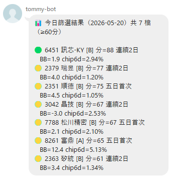

# 台股上市上櫃電子個股創高拉回、主力未撤篩選系統

- 這是一套專門篩選台股上市櫃電子股的系統，找出那些股價從高點回檔、但主力籌碼依然留在場內的潛力標的。
- 本系統的開發精髓，源自股市雙雄「蔡董」與「賴董」多年來在股海翻騰、強取豪奪的實戰經驗。系統中沒有生硬艱澀的學術理論，如果有，那就有，不要來問我，我也不懂。
- 系統獲取資料所使用之 API 均為免費公開資訊，資料能拿得到的就盡量拿，拿不到的、要花錢的，就不拿，就這麼有個性，不是花不起錢，就是不想花錢。
- 製作這套系統的過程極具挑戰。蔡董脾氣不好，一言不合就叫你走，你不走他就買一台賓士送你走。在如此高壓又誘惑的淬鍊下，本系統終於誕生。
- ⚠️ 免責聲明：本系統跑出的結果僅供邏輯驗證與研究參考，不構成任何投資買賣建議。股市有風險，投資需謹慎。如果你真的跟著系統操作傻傻的買了，記得賺了要分我，但是賠了不要找我。

---

## 系統目標

1. **每日自動爬取**台股上市上櫃電子類股的價量與籌碼資料
2. **量化篩選**符合「主力洗盤、準備再創新高」條件的個股
3. **視覺化儀表板**呈現篩選結果與各項指標
4. **提供投資建議**並標示潛在風險警示

---

## UI


---

## 可結合 Line 通知，當然你也可以外掛券商 API 直接下單 



---

## 篩選邏輯

### 入場條件總覽

**入場資格 = A 或 B（任一成立即入列）**

| 策略 | 條件 | 說明 |
|------|------|------|
| **A** | BB壓縮突破 + 今日創30日新高 + 今日出量≥MA20×1.5 + chip_1d≥1% AND chip_12d>0 + 趨勢保護 | 突破當日訊號 |
| **B** | 近50個交易日內曾創30日新高 + 今日BB位階≤5 + chip_6d≥1% AND chip_12d≥1% + 趨勢保護 | 創高後拉回訊號 |

> A 策略偵測今日發生的突破；B 策略偵測過去已突破、目前拉回月線附近且籌碼尚未撤退的標的。

---

### 核心定義

#### 何謂「創高」

創高定義為**突破當天**（不是之後幾天），需同時滿足：

```
創高條件（基本兩項）：
  1. 今日收盤 > 前30日內最高收盤  且  昨日收盤 < 前30日內最高收盤  ← 必須是突破當天
  2. 創高當日布林位階 > 8（確認突破有動能，非弱勢假突破）
```

> 用「昨日 < 30日高 且今日 ≥ 30日高」確保只抓突破當天，避免突破後持續強勢區被重複計入。

**A 策略額外條件（出量）：**

```
今日成交量 ≥ 20日均量 × 1.5（漲停鎖住除外）
```

**BB 帶寬壓縮（A 策略必要前提）：**

```
帶寬率    = (上軌 − 下軌) / MA20
帶寬_MA20 = 帶寬率的 20 日移動平均

盤整確認 = 最近5日中 ≥ 3 日的帶寬率 < 帶寬_MA20 × 0.85
```

> A 策略要求「突破前已有 BB 壓縮（squeeze=True）」，確認為盤整蓄勢後的有效突破。
> 實證（啟碁 6285）：5/4~5/11 帶寬壓縮（squeeze=True），5/12 出量突破30日新高位階10.3

#### 何謂「拉回」— 用布林位階衡量

不用簡單%跌幅，改用**布林通道位階**：

```
布林中軌 = MA20（月線，20日移動平均）
布林上軌 = MA20 + 2 × STD20
布林下軌 = MA20 − 2 × STD20

布林位階 = (收盤價 − MA20) / (2 × STD20) × 10
```

| 位階值 | 對應位置 | 意義 |
|--------|---------|------|
| > +10 | 上軌以上 | 強勢延伸（可超過10） |
| +10 | 上軌 | 強勢突破 |
| +5 ~ +10 | 月線↔上軌 | 強勢區 |
| 0 | 月線（中軌） | 標準支撐，最佳切入點 |
| -5 ~ 0 | 月線↔下軌 | 偏弱，需觀察 |
| < -10 | 下軌以下 | 極弱（可低於-10） |

> 位階可超出 ±10（超出布林帶時延伸計算，不截斷）。
> 實證：聯鈞 5/12 位階 12.8（創高）→ 5/17 位階 2.8（急速回測月線）✅

#### 何謂「主力」

本系統定義「主力」為**法人籌碼**，具體指：

| 主力組成 | 資料來源 | 說明 |
|---------|---------|------|
| **外資**（外國機構投資人） | TWSE T86 | 單一最大籌碼，能持續推升股價 |
| **投信**（國內投信基金） | TWSE T86 | 台灣本土法人，通常跟隨外資方向 |

> 自營商因有避險部位干擾，本系統不計入主力判斷。

**主力未撤（籌碼好）的量化定義（B 策略必要條件）：**

```
兩個條件都要滿足：
  法人買超比率（6日）  = (外資6日淨買超 + 投信6日淨買超) / 股本（張）× 100% ≥ 1%
  法人買超比率（12日） = (外資12日淨買超 + 投信12日淨買超) / 股本（張）× 100% ≥ 1%
```

> 用**股本**正規化而非成交量：台積電和小型股絕對買超張數差距極大，除以股本才能橫向比較。
> 兩個窗口都需滿足，確認籌碼穩定，避免短期衝量但中期撤退的情況。

---

### 入場策略詳細規格

#### 策略 A：BB壓縮突破（今日訊號）

```
全部條件同日成立：
  1. BB 帶寬壓縮（squeeze=True）：最近5日中 ≥ 3日帶寬 < 帶寬_MA20 × 0.85
  2. 今日創30日新高：today_close > max(前30日收盤) AND yesterday_close < max(前30日收盤)
  3. 今日出量：成交量 ≥ 20日均量 × 1.5
  4. 創高位階 > 8（確認突破動能）
  5. 籌碼：chip_ratio_1d ≥ 1% AND chip_ratio_12d > 0%（突破當日主力必須積極買，12日方向正確即可）
  6. 趨勢保護（必要條件，見下）
```

#### 策略 B：創高後拉回（歷史訊號 + 當前位置）

```
條件：
  1. 近50個交易日內曾出現30日新高突破事件（創高位階 > 8）
  2. 今日BB位階 ≤ 5（已拉回至月線附近）
  3. 籌碼好：chip_ratio_6d ≥ 1% AND chip_ratio_12d ≥ 1%（主力未撤）
  4. 趨勢保護（必要條件，見下）
```

---

### 核心量化公式

#### 1. 布林位階篩選

```
A 策略（突破日）：
  創高位階 > 8               # 突破有動能
  BB 帶寬已壓縮              # 盤整蓄勢後突破

B 策略（拉回切入）：
  今日位階 ≤ 5               # 已拉回月線附近
```

| 當日位階 | 型態 | 評分 |
|---------|------|------|
| 0 ~ 2 | 回測月線，最佳切入 | 高分 |
| 2 ~ 5 | 月線上方洗盤中 | 中分 |
| > 5 | 拉回不足（A 策略突破日正常） | 視情況 |

---

#### 2. 量能比率（顯示用）

```
量縮比率 = 近5日均量 / 前5日均量   # 拉回期 vs 上漲期
```

> 量縮比率為顯示指標，不作為入場硬篩選條件。

---

#### 3. 籌碼指標

| 指標 | 公式 | 來源 | 頻率 |
|------|------|------|------|
| 法人買超比率（6日） | (外資+投信6日淨買超) / 股本 ≥ 1% | TWSE T86 | 日 |
| 法人買超比率（12日） | (外資+投信12日淨買超) / 股本 ≥ 1% | TWSE T86 | 日 |
| 大股東持股比例 | 持有1000張以上股東持股比 | FinMind TaiwanStockShareholding | 週 |

> 法人買超比率兩個窗口都需 ≥ 1% 才算「籌碼好」（B策略必要條件）。
> 用股本正規化（而非成交量）：不同規模股票才能橫向比較。

---

### 三道避險鎖（強制過濾）

#### 避險鎖 1：趨勢保護（不買空頭股）

```
條件：MA20 > MA60  且  MA60 斜率 > 0  且  收盤價 > MA60
```

- 月線在季線之上：短中期多頭排列
- 季線斜率為正：中期趨勢向上
- 收盤價在季線以上：股價未跌破中期支撐
- 任一不符 → 直接排除

---

#### 避險鎖 2：強制停損警示

```
警示觸發條件（優先序）：
  主要：當日收盤價 < 拉回期間最低價（破底收盤）
  輔助：當日收盤價 < 進場日 MA20 × (1 − 0.05)  # 跌破月線 5%
```

- 主要條件（破底）為硬停損警示
- 輔助條件（月線-5%）為軟性提醒，避免日常震盪誤觸
- 觸發後儀表板顯示紅色 ⛔ 警告，不自動執行交易

> 舊版月線-3%偏緊，容易被正常震盪洗出，改為-5%或以破底為主要判斷。

---

### 綜合評分機制

各指標分別計算分數，加權合計後決定建議等級：

| 指標 | 權重 | 說明 |
|------|------|------|
| 布林位階（0~2最高分） | 25% | 越靠近月線越好 |
| 法人買超/股本（6日+12日雙窗口各12.5%） | 25% | 主力未撤（用股本正規化） |
| 帶寬壓縮突破加分 | 15% | 型態品質 |
| RS 優於大盤 | 15% | 個股 BB 降幅 < 大盤降幅 × 1.2 |
| 大戶千張人數增加 | 5% | 額外加分 |

### 投資建議分類

| 分類 | 條件 | 建議 |
|------|------|------|
| 🟢 強烈建議 | 前提全過 + 三公式全過 + 三避險鎖全過 + 綜合分數 ≥ 80 | 積極布局 |
| 🟡 觀察等待 | 前提全過 + 三公式全過 + 避險鎖全過 + 分數 60~79 | 等止跌K棒確認再進場 |
| 🔴 風險警示 | 任一前提或避險鎖不符合，或分數 < 60 | 暫勿進場 |
| ⛔ 停損警示 | 已進場後觸發避險鎖 3 | 考慮停損出場 |

---

## 系統架構

```
institutional-investors/
├── backend/                  # FastAPI 後端
│   ├── app/
│   │   ├── main.py           # FastAPI 進入點
│   │   ├── api/
│   │   │   ├── stocks.py     # 篩選結果 API
│   │   │   ├── detail.py     # 個股詳細資料 API
│   │   │   └── scheduler.py  # 排程觸發 API
│   │   ├── services/
│   │   │   ├── fetcher.py    # 資料爬取（TWSE、FinMind、Scrapling）
│   │   │   ├── screener.py   # 篩選邏輯（技術面 + 籌碼面）
│   │   │   ├── risk.py       # 風險警示計算
│   │   │   └── advisor.py    # 投資建議生成
│   │   ├── models/
│   │   │   └── schemas.py    # Pydantic 資料模型
│   │   └── db/
│   │       └── store.py      # 輕量資料存儲（JSON / SQLite）
│   ├── pyproject.toml        # uv 套件管理
│   └── uv.lock
├── frontend/                 # React 前端儀表板
│   ├── src/
│   │   ├── components/
│   │   │   ├── Dashboard.tsx         # 主儀表板
│   │   │   ├── StockCard.tsx         # 個股卡片
│   │   │   ├── MetricGauge.tsx       # 儀表圓盤（CSAT 風格）
│   │   │   ├── ChipChart.tsx         # 籌碼趨勢圖
│   │   │   ├── PriceChart.tsx        # 價量走勢圖
│   │   │   ├── RiskBadge.tsx         # 風險警示標籤
│   │   │   └── SummaryPanel.tsx      # 統計摘要面板
│   │   ├── pages/
│   │   │   ├── Home.tsx              # 主頁（篩選清單）
│   │   │   └── StockDetail.tsx       # 個股詳頁
│   │   ├── hooks/
│   │   │   └── useStockData.ts       # API 資料 hook
│   │   └── App.tsx
│   ├── package.json
│   └── vite.config.ts
├── plan.md                   # 實作計劃（階段性任務）
└── README.md                 # 本文件
```

---

## 資料更新時間表

> ⚠️ 台股各資料來源有固定發布時間，程式必須在對應時間後才能抓到當日完整資料。
> **建議每日排程執行時間：21:00 後**（確保所有來源均已更新完畢）

| 資料類型 | 來源 | 發布時間 | 備註 |
|---------|------|---------|------|
| 盤中即時股價 | TWSE / TPEx | 09:00 ~ 13:30 | 僅交易時段有效 |
| 個股日收盤成交資料 | TWSE / TPEx | 15:30 後 | 收盤後約30分鐘 |
| 三大法人買賣超 | TWSE / TPEx | **16:00 後** | 通常3點多出來，4點前完整 |
| 融資融券餘額 | TWSE / TPEx | **18:00 後** | 盤後結算較慢 |
| 券商分點買賣明細 | TWSE | **18:00 ~ 20:00** | 每日下午發布，時間不固定 |
| FinMind 同步 | FinMind API | **19:00 後** | 從 TWSE 同步，有延遲 |
| WantGoo 八大官股 | 玩股網 | **18:00 後** | 手動整理，時間不固定 |
| CMoney 分點前5大 | CMoney | **20:00 後** | 依 TWSE 分點檔更新 |
| yfinance 歷史K線 | Yahoo Finance | **隔日 00:00 後** | 台股收盤當日通常晚間更新 |

### 排程策略

```
非交易日（週六、週日、國定假日）→ 跳過，不執行
交易日自動執行流程：

16:00  Job 1 — 抓三大法人 + 日成交資料（最早可用）
18:30  Job 2 — 抓融資融券 + WantGoo 官股
20:30  Job 3 — 抓 CMoney 分點資料 + FinMind 同步確認
21:00  Job 4 — 執行篩選計算 + 生成投資建議 + 更新儀表板快取
```

> **注意：** yfinance 台股歷史資料通常當日晚間更新，若需當日收盤價建議優先用 TWSE API，yfinance 僅作備援。

### 網站資料狀態顯示規則

網站依當前時間自動顯示資料完整度狀態，提醒使用者建議是否可信：

| 時段 | 資料狀態 | 網站顯示 |
|------|---------|---------|
| 非交易日（週六、日、假日） | 無新資料 | 「休市中，顯示最後交易日建議」 |
| 交易日 00:00 ~ 16:00 | 昨日資料 | 「⏳ 今日資料尚未更新，顯示昨日建議」 |
| 交易日 16:00 ~ 18:30 | 部分資料 | 「⚠️ 法人資料已更新，融資／分點尚未完整」 |
| 交易日 18:30 ~ 21:00 | 大部分資料 | 「⚠️ 資料陸續更新中，建議尚未完整」 |
| 交易日 21:00 後 | 完整資料 | 「✅ 今日資料完整，建議結果可參考」 |

> 儀表板標頭須顯示「資料截止時間」與「資料完整度」，避免使用者在下午看到未更新完的建議而誤判。

---

## 資料範圍限制

> **重要：本系統只處理台股上市（TWSE）和上櫃（TPEx）的電子類股。**

- `stock_list` 只收錄 TWSE 上市 + TPEx 上櫃的電子類股（約 1055 檔）
- 每日爬取 TWSE T86（全市場）/ TWT93U（融資）等 API 回傳的全市場資料時，**插入前過濾**，只寫入 `stock_list` 中存在的代號
- 非電子股、興櫃、創新板、ETF 等一律不寫入，不佔 DB 空間

---

## 資料來源

> 經實測去重後，每種資料只選一個最穩定的來源，避免重複爬取。

### v1 採用來源（已驗證可抓到資料）

| 資料類型 | 來源 | Endpoint / 方式 | 實測結果 |
|---------|------|----------------|---------|
| 上市電子股清單 | TWSE | `BWIBBU_d?selectType=ALL` | ✅ 1074筆 |
| 上櫃電子股清單 | TPEx | `otc_quotes_no1430` | ✅ 交易日驗證 |
| 三大法人買賣超（當日） | TWSE | `T86?selectType=ALLBUT0999` | ✅ 1311筆 |
| 三大法人買賣超（上櫃當日） | TPEx | `3itrade_hedge_result` | ✅ 交易日驗證 |
| 三大法人買賣超（歷史） | FinMind | `TaiwanStockInstitutionalInvestorsBuySell` | ✅ 253筆 |
| 日K線量價（歷史） | FinMind | `TaiwanStockPrice` | ✅ 253筆，空 token 可用 |
| 融資融券餘額 | TWSE | `TWT93U` | ✅ 1275筆 |
| 大盤加權指數（RS計算） | yfinance | `^TWII` | ✅ 備援個股量價 |

### v2 預計新增（技術難度較高，v1 暫不實作）

| 資料類型 | 來源 | 狀況 | 說明 |
|---------|------|------|------|
| 八大官股行庫買賣超 | WantGoo | ❌ API 需 session + CSRF | 獨家資料，待研究正確呼叫方式 |
| 分點前5大買超/賣超 | CMoney 籌碼K線 | ❌ URL 需修正 | 分點資料，補強籌碼集中度精準度 |

### 去重決策說明

| 重疊情形 | 選擇 | 原因 |
|---------|------|------|
| 日K線：TWSE vs FinMind vs yfinance | **FinMind**（yfinance備援） | FinMind 格式標準、歷史完整 |
| 三大法人：TWSE vs FinMind | **TWSE 當日 + FinMind 歷史** | TWSE 最即時，FinMind 補歷史 |
| 融資融券：TWSE vs FinMind vs TPEx | **TWSE TWT93U** | 官方直接，1275筆實測通過 |
| 上市vs上櫃 | **兩者都要** | 電子股橫跨上市上櫃，缺一不可 |

---

## 技術棧

### 後端

| 技術 | 版本 | 用途 |
|------|------|------|
| Python | 3.12+ | 主語言 |
| uv | latest | 套件與環境管理 |
| FastAPI | latest | REST API 框架 |
| SQLAlchemy 2.0 (async) | latest | ORM |
| asyncpg | latest | PostgreSQL async driver |
| alembic | latest | DB schema migration |
| Scrapling | latest | 反爬蟲爬蟲 |
| yfinance | latest | 大盤指數（^TWII）備援 |
| pandas / numpy | latest | 資料處理、布林帶計算 |
| APScheduler | latest | 每日定時爬取（4個排程 Job） |

### 前端

| 技術 | 用途 |
|------|------|
| React 18 + TypeScript | UI 框架 |
| Vite | 建置工具 |
| Recharts | 圖表（布林帶、籌碼、量價） |
| Tailwind CSS | 樣式 |
| React Query | API 狀態管理 |

### 基礎設施

| 技術 | 用途 |
|------|------|
| Docker + docker-compose | 容器化部署 |
| PostgreSQL 16 | 主資料庫 |

---

## Docker Compose 架構

```yaml
services:
  db:
    image: postgres:16-alpine
    environment:
      POSTGRES_DB: stock_force
      POSTGRES_USER: stock
      POSTGRES_PASSWORD: secret        # ⚠️ 僅限本地開發，生產環境改用 .env
    ports:
      - "5432:5432"
    volumes:
      - pgdata:/var/lib/postgresql/data

  backend:
    build: ./backend
    depends_on: [db]
    ports:
      - "8000:8000"
    environment:
      DATABASE_URL: postgresql+asyncpg://stock:secret@db:5432/stock_force
      FINMIND_TOKEN: ""                # 選填：有 token 可解除 FinMind 限速

  frontend:
    build: ./frontend
    ports:
      - "3000:3000"
    depends_on: [backend]

volumes:
  pgdata:
```

> ⚠️ **安全提醒**：`POSTGRES_PASSWORD: secret` 僅供本地開發。生產環境請改用 `.env` 搭配 `env_file` 或 Docker Secrets，並確保 `.env` 已加入 `.gitignore`。

```bash
docker compose up -d db      # 開發時只啟動 DB
docker compose up            # 全起（DB + 後端 + 前端）
```

---

## 資料庫設計

避免每日重複爬取，歷史資料只存一次，每日只增量新增當日一筆。

### 資料表清單

| 資料表 | 說明 | 唯一鍵 |
|--------|------|--------|
| `stock_list` | 電子股基本資料與族群標籤 | `code` |
| `daily_price` | 個股日K線 OHLCV | `(code, trade_date)` |
| `institutional` | 三大法人每日買賣超 | `(code, trade_date)` |
| `margin_trading` | 融資融券每日餘額 | `(code, trade_date)` |
| `shareholding` | 千張大戶持股（FinMind 週報） | `(code, report_date)` |
| `screening_result` | 每日篩選結果與評分 | `(code, calc_date)` |
| `fetch_log` | 爬取作業紀錄（防重複） | `(job_name, fetch_date)` |

### 詳細欄位設計

#### `stock_list`

| 欄位 | 型別 | 說明 |
|------|------|------|
| `code` | VARCHAR(10) | 股票代號（唯一） |
| `name` | VARCHAR(50) | 股票名稱 |
| `market` | VARCHAR(10) | 上市 `TWSE` / 上櫃 `TPEx` |
| `sector` | VARCHAR(50) | 產業別（電子工業等） |
| `tags` | TEXT | 子族群標籤 JSON 陣列，如 `["AI","散熱"]` |
| `updated_at` | DATETIME | 清單最後更新時間 |

#### `daily_price`

| 欄位 | 型別 | 說明 |
|------|------|------|
| `code` | VARCHAR(10) | 股票代號 |
| `trade_date` | DATE | 交易日 |
| `open` | FLOAT | 開盤價 |
| `high` | FLOAT | 最高價 |
| `low` | FLOAT | 最低價 |
| `close` | FLOAT | 收盤價 |
| `volume` | INTEGER | 成交量（股） |

#### `institutional`（三大法人）

| 欄位 | 型別 | 說明 |
|------|------|------|
| `code` | VARCHAR(10) | 股票代號 |
| `trade_date` | DATE | 交易日 |
| `foreign_net` | FLOAT | 外資淨買超（股） |
| `trust_net` | FLOAT | 投信淨買超（股） |
| `dealer_net` | FLOAT | 自營商淨買超（股） |
| `three_major_net` | FLOAT | 三大法人合計淨買超 |

#### `margin_trading`（融資融券）

| 欄位 | 型別 | 說明 |
|------|------|------|
| `code` | VARCHAR(10) | 股票代號 |
| `trade_date` | DATE | 交易日 |
| `margin_balance` | INTEGER | 融資餘額（張） |
| `margin_change` | INTEGER | 融資增減（張） |
| `short_balance` | INTEGER | 融券餘額（張） |
| `short_change` | INTEGER | 融券增減（張） |

#### `shareholding`（持股集中度）

| 欄位 | 型別 | 說明 |
|------|------|------|
| `code` | VARCHAR(10) | 股票代號 |
| `report_date` | DATE | 週報日期（每週五） |
| `holders_1000_lot` | INTEGER | 持有 1,000 張以上股東人數 |
| `pct_1000_lot` | FLOAT | 千張大戶持股佔比 (%) |

#### `screening_result`（篩選結果）

| 欄位 | 型別 | 說明 |
|------|------|------|
| `code` | VARCHAR(10) | 股票代號 |
| `calc_date` | DATE | 計算日期 |
| `tags` | TEXT | 子族群標籤（冗餘存放，加速查詢） |
| `bb_position` | FLOAT | 當前布林位階（-10 ~ +10） |
| `bb_peak` | FLOAT | 創高當日布林位階 |
| `peak_date` | DATE | 創高日期 |
| `is_squeeze` | BOOLEAN | 創高前是否有布林帶寬壓縮 |
| `vol_ratio` | FLOAT | 近5日 / 前5日均量比 |
| `foreign_6d_net` | FLOAT | 外資近6日淨買超（張） |
| `trust_6d_net` | FLOAT | 投信近6日淨買超（張） |
| `margin_5d_chg` | FLOAT | 融資近5日增減率 |
| `holders_1000_chg` | FLOAT | 千張大戶人數變化 |
| `rs_vs_market` | FLOAT | 相對大盤 BB 降幅比 |
| `score` | FLOAT | 綜合評分（0 ~ 100） |
| `passes` | BOOLEAN | 是否通過所有前提條件 |

#### `fetch_log`（爬取紀錄）

| 欄位 | 型別 | 說明 |
|------|------|------|
| `job_name` | VARCHAR(50) | 作業名稱（`job1` ~ `job4`） |
| `fetch_date` | DATE | 爬取日期 |
| `status` | VARCHAR(20) | `success` / `failed` / `skipped` |
| `rows_fetched` | INTEGER | 本次寫入筆數 |
| `created_at` | DATETIME | 記錄建立時間 |

`fetch_log` 策略：每次爬取前查詢當日是否已有 `success` 紀錄，有則跳過，避免重複爬同一天。

### ER Diagram（文字版）

```
stock_list (code PK)
    ↓ 1:N
daily_price      (code, trade_date PK)
institutional    (code, trade_date PK)
margin_trading   (code, trade_date PK)
shareholding     (code, report_date PK)
screening_result (code, calc_date PK)

fetch_log (job_name, fetch_date PK)  ← 獨立，不關聯其他表
```

---

## 儀表板設計（參考附圖風格）

### 主頁面佈局

**台股主力未撤回檔篩選儀表板　　　　　　　　　　更新時間：今日 18:30**

| 篩出個股數 | 平均回檔幅度 | 強烈建議買進 | 中性 | 觀望 |
|:---:|:---:|:---:|:---:|:---:|
| N 檔 | -14.3% | 🟢 N | 🟡 N | 🔴 N |

**個股清單（卡片式）**

| 2330 台積 | 2454 聯發 | 2382 廣達 |
|:---:|:---:|:---:|
| 回檔 15% | 回檔 12% | 回檔 18% |
| 籌碼 ✅ | 籌碼 ✅ | 籌碼 ⚠️ |
| 建議：買進 | 建議：觀察 | 建議：等待 |

**圖表區**

| 回檔幅度分佈圖 | 三大法人趨勢圖 | 籌碼集中度走勢 |
|:---:|:---:|:---:|

### 個股詳頁

- 價量走勢圖（含MA10/MA20/MA60）
- 三大法人每日買賣超長條圖
- 籌碼集中度趨勢線
- 融資餘額變化
- 技術面/籌碼面評分儀表盤（圓形gauge）
- 風險警示區塊
- 投資建議文字說明

---

## 投資建議邏輯

| 分類 | 條件 | 建議 |
|------|------|------|
| 強烈買進 | 回檔10-20% + 量縮1/3 + 法人持續買 + 季線以上 + 止跌訊號 | 🟢 強烈建議買進 |
| 觀察等待 | 回檔中 + 部分條件符合 + 無止跌訊號 | 🟡 持續觀察，等止跌確認 |
| 風險警示 | 回檔 > 25% 或 量未縮或 法人賣超 | 🔴 暫勿進場，風險偏高 |

> **免責聲明**：本系統提供之分析僅供參考，不構成投資建議。投資人須自行判斷並承擔相關風險。

---

## 快速啟動（待實作後更新）

```bash
# 後端
cd backend
uv sync
uv run uvicorn app.main:app --reload

# 前端
cd frontend
npm install
npm run dev
```

---

## 開發進度

見 [plan.md](./plan.md)
