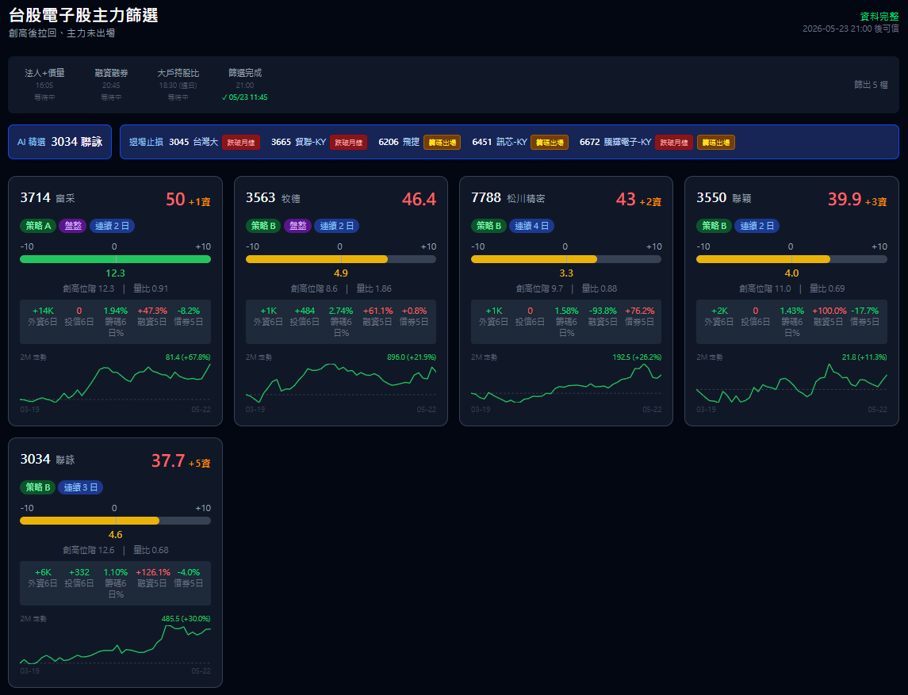
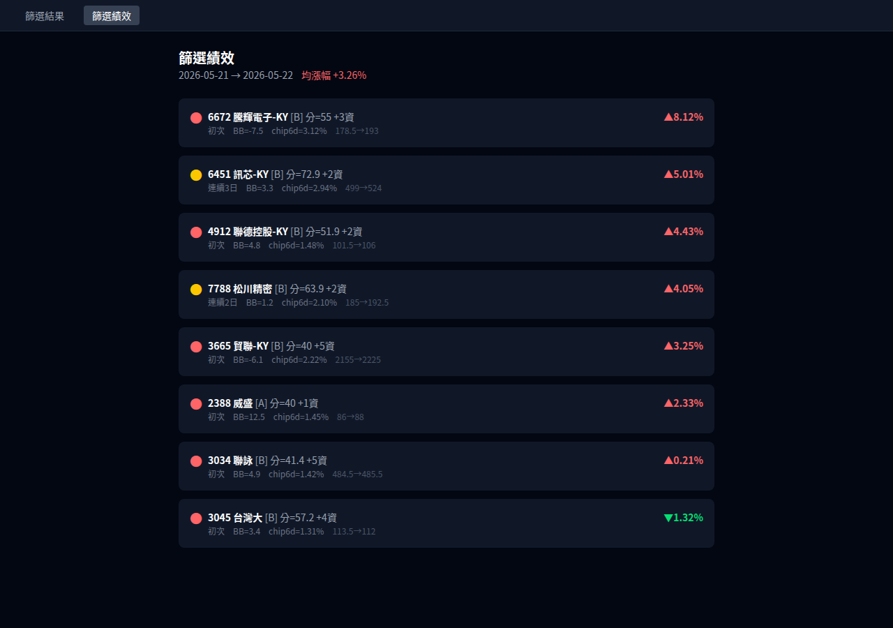
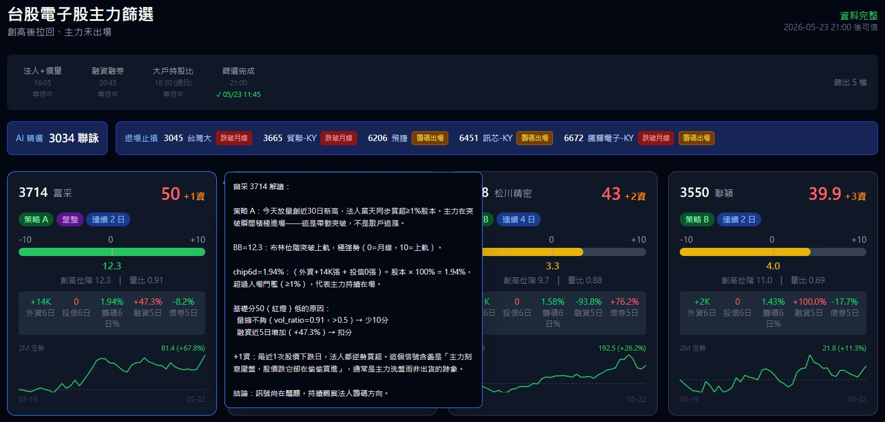

# 台股上市上櫃電子個股創高拉回、主力未撤篩選系統

- 這是一套專門篩選台股上市櫃電子股的系統，找出那些股價從高點回檔、但主力籌碼依然留在場內的潛力標的。
- 本系統的開發精髓，源自股市雙雄「蔡董」與「賴董」多年來在股海翻騰、強取豪奪的實戰經驗。系統中沒有生硬艱澀的學術理論，如果有，那就有，不要來問我，我也不懂。
- 系統獲取資料所使用之 API 均為免費公開資訊，資料能拿得到的就盡量拿，拿不到的、要花錢的，就不拿，就這麼有個性，不是花不起錢，就是不想花錢。
- 製作這套系統的過程極具挑戰。蔡董脾氣不好，一言不合就叫你走，你不走他就買一台賓士送你走。在如此高壓又誘惑的淬鍊下，本系統終於誕生。
- ⚠️ 免責聲明：本系統跑出的結果僅供邏輯驗證與研究參考，不構成任何投資買賣建議。股市有風險，投資需謹慎。如果你真的跟著系統操作傻傻的買了，記得賺了要分我，但是賠了不要找我。

---

## 系統目標

1. **每日自動爬取**台股上市上櫃電子類股的價量與籌碼資料
2. **量化篩選**符合「主力洗盤、準備再創新高」條件的個股
3. **視覺化儀表板**呈現篩選結果與各項指標
4. **提供投資建議**並標示潛在風險警示

---

## UI







---

## 篩選邏輯

### 名詞速覽

| 術語 | 全名 | 白話說明 |
|------|------|---------|
| **BB** | 布林通道（Bollinger Bands） | 以 20 日均線為中心的價格通道。**BB 位階 = 0** 表示收盤剛好在月線上，**位階 10** 表示在布林上軌，**位階 -10** 表示在布林下軌。越靠近 0 代表回檔越充分。 |
| **chip_Nd** | 法人籌碼比率（N 日） | （外資 + 投信）近 N 日淨買超張數 ÷ 股本 × 100%。代表主力在 N 天內累積了多少比例的股票。`chip_1d` 當日、`chip_6d` 近 6 日、`chip_12d` 近 12 日。 |
| **squeeze** | BB 帶寬壓縮 | 股價長時間盤整，布林帶變窄（帶寬 < 20 日均帶寬 × 85%），代表蓄勢待發。 |
| **MA20 / MA60** | 20 日 / 60 日移動平均線 | MA20 = 月線，MA60 = 季線。趨勢保護要求月線在季線之上且季線向上。 |

---

### 入場條件總覽

**入場資格 = A 或 B（任一成立即入列）**

| 策略 | 條件 | 說明 |
|------|------|------|
| **A** | BB 壓縮突破 + 今日創 30 日新高 + 今日出量 ≥ MA20 × 1.5 + chip_1d ≥ 1% AND chip_12d > 0 + 趨勢保護 | 突破當日訊號 |
| **B** | 近 50 個交易日內曾創 30 日新高 + 今日 BB 位階 0~5（≥0 且 ≤5，跌破月線不入場）+ chip_6d ≥ 1% AND chip_12d ≥ 1% + 趨勢保護 | 創高後拉回訊號 |

> A 策略偵測今日發生的突破；B 策略偵測過去已突破、目前拉回月線附近且籌碼尚未撤退的標的。

---

### 核心定義

#### 何謂「創高」

創高定義為**突破當天**（不是之後幾天），需同時滿足：

```
創高條件（基本兩項）：
  1. 今日收盤 > 前 30 日內最高收盤  且  昨日收盤 < 前 30 日內最高收盤  ← 必須是突破當天
  2. 創高當日布林位階 > 8（確認突破有動能，非弱勢假突破）
```

> 用「昨日 < 30 日高 且今日 ≥ 30 日高」確保只抓突破當天，避免突破後持續強勢區被重複計入。

**A 策略額外條件（出量）：**

```
今日成交量 ≥ 20 日均量 × 1.5（漲停鎖住除外）
```

**BB 帶寬壓縮（A 策略必要前提）：**

```
帶寬率    = (上軌 − 下軌) / MA20
帶寬_MA20 = 帶寬率的 20 日移動平均

盤整確認 = 最近 5 日中 ≥ 3 日的帶寬率 < 帶寬_MA20 × 0.85
```

> A 策略要求「突破前已有 BB 壓縮（squeeze=True）」，確認為盤整蓄勢後的有效突破。
> 實證（啟碁 6285）：5/4~5/11 帶寬壓縮（squeeze=True），5/12 出量突破 30 日新高位階 10.3

#### 何謂「拉回」— 用布林位階衡量

不用簡單 % 跌幅，改用**布林通道位階**：

```
布林中軌 = MA20（月線，20 日移動平均）
布林上軌 = MA20 + 2 × STD20
布林下軌 = MA20 − 2 × STD20

布林位階 = (收盤價 − MA20) / (2 × STD20) × 10
```

| 位階值 | 對應位置 | 意義 |
|--------|---------|------|
| > +10 | 上軌以上 | 強勢延伸（可超過 10） |
| +10 | 上軌 | 強勢突破 |
| +5 ~ +10 | 月線 ↔ 上軌 | 強勢區 |
| 0 | 月線（中軌） | 標準支撐，最佳切入點 |
| -5 ~ 0 | 月線 ↔ 下軌 | 偏弱，需觀察 |
| < -10 | 下軌以下 | 極弱（可低於 -10） |

> 位階可超出 ±10（超出布林帶時延伸計算，不截斷）。
> 實證：聯鈞 5/12 位階 12.8（創高）→ 5/17 位階 2.8（急速回測月線）✅

#### 何謂「主力」

本系統定義「主力」為**法人籌碼**，具體指：

| 主力組成 | 資料來源 | 說明 |
|---------|---------|------|
| **外資**（外國機構投資人） | TWSE T86 | 單一最大籌碼，能持續推升股價 |
| **投信**（國內投信基金） | TWSE T86 | 台灣本土法人，通常跟隨外資方向 |

> 自營商因有避險部位干擾，本系統不計入主力判斷。

**主力未撤（籌碼好）的量化定義（B 策略必要條件）：**

```
兩個條件都要滿足：
  法人買超比率（6 日）  = (外資6日淨買超 + 投信 6 日淨買超) / 股本（張）× 100% ≥ 1%
  法人買超比率（12 日） = (外資12日淨買超 + 投信 12 日淨買超) / 股本（張）× 100% ≥ 1%
```

> 用**股本**正規化而非成交量：台積電和小型股絕對買超張數差距極大，除以股本才能橫向比較。
> 兩個窗口都需滿足，確認籌碼穩定，避免短期衝量但中期撤退的情況。

---

### 入場策略詳細規格

#### 策略 A：BB 壓縮突破（今日訊號）

全部條件同日成立：

1. **BB 帶寬壓縮**：最近 5 日中有 ≥ 3 日帶寬低於 20 日均帶寬的 85%（代表股價盤整蓄勢）
2. **今日創 30 日新高**：今日收盤突破前 30 日最高收盤，且昨日尚未突破（只抓突破當天）；收盤須在當日高低區間的上 70% 以上（過濾長上影線假突破，即 `(close - low) / (high - low) ≥ 0.7`）
3. **今日出量**：今日成交量 ≥ 20 日均量 × 1.5 倍
4. **突破有動能**：突破當日的布林位階 > 8（排除弱勢假突破）
5. **籌碼條件**：突破當日外資 + 投信淨買超 ÷ 股本 ≥ 1%（當日主力積極進場），且近 12 日累積淨買超方向為正（未反手賣出）
6. **趨勢保護**（必要條件，見下）

#### 策略 B：創高後拉回（歷史訊號 + 當前位置）

1. **歷史突破紀錄**：近 50 個交易日內，曾出現收盤突破前 30 日高點且位階 > 8 的突破事件
2. **目前已拉回**：今日布林位階 0~5（≥0 且 ≤5；跌破月線 BB<0 不入場，與退場邏輯一致）
3. **主力未撤**：近 6 日外資 + 投信累積淨買超 ÷ 股本 ≥ 1%，且近 12 日也 ≥ 1%（兩個窗口都要過，確認籌碼穩定）
4. **趨勢保護**（必要條件，見下）

---

### 核心量化公式

#### 1. 布林位階篩選

- **A 策略（突破日）**：突破當日布林位階 > 8（有動能），且突破前帶寬已壓縮（盤整蓄勢）
- **B 策略（拉回切入）**：今日布林位階 ≤ 5（已拉回月線附近）

| 當日位階 | 型態 | 評分 |
|---------|------|------|
| 0 ~ 2 | 回測月線，最佳切入 | 高分 |
| 2 ~ 5 | 月線上方洗盤中 | 中分 |
| > 5 | 拉回不足（A 策略突破日正常） | 視情況 |

---

#### 2. 拉回窒息量

近 5 日均量 ÷ 前 5 日均量（`vol_ratio`）。

```
vol_ratio = mean(volume[-5:]) / mean(volume[-10:-5])
窒息量條件：vol_ratio ≤ 0.5（近5日均量縮到前5日一半以下）
```

> 量縮是鑑別「主力洗盤」vs「大戶出貨」的關鍵：拉回時 BB 壓縮但每天放量下跌 = 出貨；BB 壓縮 + 量縮 = 主力壓盤洗散戶。窒息量加計 10 分。

---

#### 3. 籌碼指標

| 指標 | 公式 | 來源 | 頻率 |
|------|------|------|------|
| 法人買超比率（6 日） | (外資 + 投信 6 日淨買超) / 股本 ≥ 1% | TWSE T86 | 日 |
| 法人買超比率（12 日） | (外資 + 投信 12 日淨買超) / 股本 ≥ 1% | TWSE T86 | 日 |
| 大股東持股比例 | 持有 1,000 張以上股東持股比 | TDCC 集保戶股權分散表（Level 15） | 週（週日 18:30 後） |

> 法人買超比率兩個窗口都需 ≥ 1% 才算「籌碼好」（B 策略必要條件）。
> 用股本正規化（而非成交量）：不同規模股票才能橫向比較。

---

### 三道避險鎖（強制過濾）

#### 避險鎖 1：趨勢保護（不買空頭股）

三個條件全部要過，任一不符直接排除：

- **月線 > 季線**：20 日均線在 60 日均線之上，短中期多頭排列
- **季線向上**：60 日均線斜率為正，中期趨勢向上（不是橫盤或下彎）
- **收盤在季線以上**：股價未跌破中期支撐，不買已跌破季線的股票

---

### 綜合評分機制

各指標分別計算分數，加權合計後決定建議等級：

| 指標 | 權重 | 說明 |
|------|------|------|
| 布林位階（0 ~ 2 最高分） | 20% | 越靠近月線越好 |
| 法人買超 / 股本（6 日 + 12 日雙窗口各 10%） | 20% | 主力未撤（用股本正規化） |
| BB 壓縮突破 | 15% | 帶寬壓縮 = 蓄勢待發，壓縮越久爆發力越強 |
| 拉回窒息量（近5日均量 ≤ 前5日均量 × 50%） | 10% | 量縮代表賣壓耗盡，主力洗盤而非出貨 |
| 融資 5 日不增 | 10% | 散戶未追漲，沒有散戶賣壓 |
| 借券 5 日不增 | 10% | 機構未加碼放空，方向偏多 |
| 大戶千張人數增加 | 10% | 籌碼沉澱，大戶默默接貨 |
| RS 優於大盤 | 5% | 個股 BB 降幅 < 大盤降幅 × 1.2，抗跌性佳 |
| **資加**（最多 +5 分） | — | 最近 5 次下跌日中，法人當日淨買超每次加 1 分 |

> **趨勢保護為硬門檻（不計入評分）：** MA20 > MA60 且 MA60 斜率向上且收盤 > MA60，三個條件任一不符直接排除，不給分。
>
> **資加說明：** 初始評分計算完畢後，查歷史找最近 5 個下跌日（收盤 < 前日收盤），若法人（外資 + 投信）當日仍淨買超，每個下跌日加 1 分（上限 +5 分）。此信號代表「主力在股價下跌時逢低承接」，是最強的籌碼沉澱訊號。

### 投資建議分類

所有通過入場條件（A 或 B）的個股均顯示，不設分數下限，依基礎分數（不含資加/戶加）分三級：

| 分類 | 條件 | 建議 |
|------|------|------|
| 🟢 強烈建議 | 通過入場條件 + 基礎分 ≥ 80 | 積極布局 |
| 🟡 觀察等待 | 通過入場條件 + 基礎分 60~79 | 等止跌 K 棒確認再進場 |
| 🔴 列入觀察 | 通過入場條件 + 基礎分 < 60 | 入場條件成立但評分不足，可搭配資加/戶加判斷，不建議貿然進場 |

> **資加**（最多 +5）代表下跌日法人逢低承接，**戶加**（可正可負）代表千張大戶本週 vs 上週持股人數差值（單位：人，正=增加，負=減少）。兩者為輔助參考，不計入基礎分三級判斷。

---

## 系統架構

```
institutional-investors/
├── backend/                  # FastAPI 後端
│   ├── app/
│   │   ├── main.py           # FastAPI 進入點（lifespan + CORS + DB migration）
│   │   ├── config.py         # 環境變數設定
│   │   ├── api/
│   │   │   ├── deps.py       # DB session 依賴
│   │   │   └── routes.py     # REST endpoints（含 /api/server-time, /api/taifex-futures, /api/us-stocks）
│   │   ├── services/
│   │   │   ├── fetcher/
│   │   │   │   ├── twse.py       # TWSE 三大法人 + 日成交 + 融資借券（TWT93U）
│   │   │   │   ├── tdcc.py       # TDCC 集保戶股權分散表 bulk CSV（千張大戶）
│   │   │   │   ├── finmind.py    # FinMind 股本 + 季報EPS + 產業鏈
│   │   │   │   ├── market.py     # yfinance 大盤指數（RS 基準）
│   │   │   │   ├── price.py      # 歷史價格補抓
│   │   │   │   └── stock_list.py # 電子股清單（FinMind）
│   │   │   ├── screener.py       # BB 計算 + A/B/C 篩選邏輯 + 評分
│   │   │   └── scheduler.py      # asyncio 排程迴圈（7 Jobs + 非交易日 fallback）
│   │   └── db/
│   │       ├── base.py       # SQLAlchemy engine + session
│   │       └── models.py     # ORM 資料模型
│   ├── pyproject.toml        # uv 套件管理
│   └── uv.lock
├── frontend/                 # React 前端儀表板
│   ├── src/
│   │   ├── components/
│   │   │   ├── BBGauge.tsx        # 布林位階進度條
│   │   │   ├── ChipBar.tsx        # 法人籌碼欄位
│   │   │   ├── PriceSparkline.tsx # 近2月走勢小圖
│   │   │   ├── StockCard.tsx      # 個股卡片（含hover動態解讀、大戶週增減）
│   │   │   ├── MarketHeader.tsx   # 頂部大盤指數 + 台指期 + server-synced 時鐘
│   │   │   └── Tooltip.tsx        # 通用 tooltip 元件
│   │   ├── pages/
│   │   │   ├── Dashboard.tsx      # 篩選結果（含AI精選狀態列 + job badges）
│   │   │   ├── DayTradePage.tsx   # 台股當沖（6子頁：今日交易/交易紀錄/盤前狀況/交易設定/系統設定/系統健診）
│   │   │   ├── Result.tsx         # 篩選績效頁（昨日結果 vs 次日收盤）
│   │   │   ├── ExitAlertsPage.tsx # 退場止損（完整 list，技術/籌碼觸發）
│   │   │   ├── Holders.tsx        # 千張大戶占比排行頁（週增減%排序）
│   │   │   ├── UsStocksPage.tsx   # 美股追蹤（收盤+盤後，08:55 台股開盤日自動更新）
│   │   │   ├── ScoreA.tsx         # 策略A最新分頁
│   │   │   ├── ScoreB.tsx         # 策略B近3日≥60分頁
│   │   │   ├── ScoreC.tsx         # 策略C基本面加速頁
│   │   │   ├── WatchlistAPage.tsx # A追蹤清單頁
│   │   │   ├── SectorFlow.tsx     # 類股資金流向頁
│   │   │   ├── IcChain.tsx        # 產業鏈頁
│   │   │   └── StockPoolPage.tsx  # 股票池頁
│   │   ├── hooks/
│   │   │   ├── useScreener.ts     # API 資料 hook
│   │   │   └── useServerTime.ts   # 全域 server-synced 時間 hook（clock + msUntilNextTaiwanTime）
│   │   ├── types/
│   │   │   └── index.ts           # TypeScript 型別定義
│   │   └── App.tsx                # Tab 路由（13 個 tab）
│   ├── package.json
│   └── vite.config.ts
├── services/
│   └── fubon-dashboard/      # 台股當沖自動交易（WSL 直接執行，非 Docker）
│       ├── run.py            # 一鍵啟動（python run.py）
│       ├── start.sh          # bash 替代啟動（bash start.sh）
│       ├── main.py           # FastAPI + WebSocket app（含 DailyScheduler）
│       ├── engine/           # 交易引擎（ORB 策略、位置管理、觸價單、排程）
│       ├── monitor/dashboard/app.py  # REST + /ws/stream WebSocket 即時推送
│       ├── requirements.txt
│       └── .env              # LINE token（不進 git）
├── scripts/
│   ├── backup-db.sh          # PostgreSQL pg_dump 備份腳本（保留最近 7 份）
│   ├── db-backup.service     # systemd service unit（手動安裝用）
│   └── db-backup.timer       # systemd timer unit（每日 02:00）
├── config/
└── README.md
```

---

## 資料更新時間表

> ⚠️ 台股各資料來源有固定發布時間，程式必須在對應時間後才能抓到當日完整資料。
> **建議每日排程執行時間：21:00 後**（確保所有來源均已更新完畢）

| 資料類型 | 來源 | 發布時間 | 備註 |
|---------|------|---------|------|
| 盤中即時股價 | TWSE / TPEx | 09:00 ~ 13:30 | 僅交易時段有效 |
| 個股日收盤成交資料 | TWSE / TPEx | 15:30 後 | 收盤後約 30 分鐘 |
| 三大法人買賣超 | TWSE / TPEx | **16:00 後** | 通常 3 點多出來，4 點前完整 |
| 融資融券餘額（含借券） | TWSE | **20:30 後** | TWT93U 同時含融資（欄2-7）與借券（欄8-12），約 20:30 更新 |
| 券商分點買賣明細 | TWSE | **18:00 ~ 20:00** | 每日下午發布，時間不固定 |
| 大戶持股集中度 | TDCC 集保戶股權分散表 | **週日 18:00 後** | 週五收盤 → 週六處理 → 週日晚間發布，opendata CSV 一次含全市場 |
| WantGoo 八大官股 | 玩股網 | **18:00 後** | 手動整理，時間不固定 |
| CMoney 分點前 5 大 | CMoney | **20:00 後** | 依 TWSE 分點檔更新 |
| yfinance 歷史 K 線 | Yahoo Finance | **隔日 00:00 後** | 台股收盤當日通常晚間更新 |

### 排程策略

```
非交易日（週六、週日、國定假日）→ 跳過，不執行
交易日自動執行流程：

18:00  Job 1 — 抓三大法人 + 日成交資料（TWSE T86，18:00 後穩定發布）
20:45  Job 2 — 抓融資借券（TWSE TWT93U，約 20:30 更新）
18:30  Job 3 — 抓 TDCC 集保持股集中度（僅週日，週日晚間完成）
21:00  Job 4 — 執行篩選計算，更新 screening_result，呼叫 Claude API 產生 AI 精選
21:05  Job 8 — 當沖篩選（pool × score-a/b → PG daytrade_candidate，隔日引擎啟動時讀取）
每月10-25日 12:00  Job 5 — 抓月營收（MOPS）
每季（3/1, 5/16, 8/15, 11/15）  Job 6 — 抓季報 EPS（FinMind TaiwanStockFinancialStatements）
每半年（1/1, 7/1）  Job 7 — 抓產業鏈分類（IC Chain），更新 ic_classification
```

> **排程引擎：** asyncio 自製 `_scheduler_loop`，每分鐘比對台北時間觸發對應 Job，取代 APScheduler，無外部依賴。

> **Job 4 資料完整性防護：** Job 4 執行前查詢 DB 確認當日 `institutional` 資料已入庫；若無資料則跳過篩選並記錄警告，避免用舊資料計算 chip_ratio_6d。

儀表板頂部狀態列顯示 7 個排程的執行狀態，完成後顯示台北時間更新時刻（如 `✓ 18:02`），尚未執行顯示「等待中」。Job5/6/7 使用動態 log key（如 `job5_202605`、`job6_q2_2026`、`job7_2026H1`）以支援多期紀錄。

> **注意：** yfinance 台股歷史資料通常當日晚間更新，若需當日收盤價建議優先用 TWSE API，yfinance 僅作備援。

### 網站資料狀態顯示規則

網站依當前時間自動顯示資料完整度狀態，提醒使用者建議是否可信：

| 時段 | 資料狀態 | 網站顯示 |
|------|---------|---------|
| 非交易日（週六、日、假日） | 無新資料 | 「休市中，顯示最後交易日建議」 |
| 交易日 00:00 ~ 16:00 | 昨日資料 | 「⏳ 今日資料尚未更新，顯示昨日建議」 |
| 交易日 16:00 ~ 18:30 | 部分資料 | 「⚠️ 法人資料已更新，融資／分點尚未完整」 |
| 交易日 18:30 ~ 21:00 | 大部分資料 | 「⚠️ 資料陸續更新中，建議尚未完整」 |
| 交易日 21:00 後 | 完整資料 | 「✅ 今日資料完整，建議結果可參考」 |

> 儀表板標頭須顯示「資料截止時間」與「資料完整度」，避免使用者在下午看到未更新完的建議而誤判。

---

## 資料範圍限制

> **重要：本系統只處理台股上市（TWSE）和上櫃（TPEx）的電子類股。**

- `stock_list` 只收錄 TWSE 上市 + TPEx 上櫃的電子類股（約 1118 檔），涵蓋產業：電子工業、電子零組件業、其他電子業、光電業、電腦及週邊設備業、電子通路業、半導體業、**通信網路業**
- 每日爬取 TWSE T86（全市場）/ TWT93U（融資）等 API 回傳的全市場資料時，**插入前過濾**，只寫入 `stock_list` 中存在的代號
- 非電子股、興櫃、創新板、ETF 等一律不寫入，不佔 DB 空間

---

## 資料來源

> 經實測去重後，每種資料只選一個最穩定的來源，避免重複爬取。

### v1 採用來源（已驗證可抓到資料）

| 資料類型 | 來源 | Endpoint / 方式 | 實測結果 |
|---------|------|----------------|---------|
| 上市電子股清單 | TWSE | `BWIBBU_d?selectType=ALL` | ✅ 1074 筆 |
| 上櫃電子股清單 | TPEx | `otc_quotes_no1430` | ✅ 交易日驗證 |
| 三大法人買賣超（當日） | TWSE | `T86?selectType=ALLBUT0999` | ✅ 1311 筆 |
| 三大法人買賣超（上櫃當日） | TPEx | `3itrade_hedge_result` | ✅ 交易日驗證 |
| 三大法人買賣超（歷史） | FinMind | `TaiwanStockInstitutionalInvestorsBuySell` | ✅ 253 筆 |
| 日 K 線量價（歷史） | FinMind | `TaiwanStockPrice` | ✅ 253 筆，空 token 可用 |
| 融資融券餘額 | TWSE | `TWT93U` | ✅ 1275 筆 |
| 借券賣出餘額 | TWSE | `TWT93U`（欄 8-12） | ✅ 與融資合併於同一表（TWT38U 已廢棄） |
| 大盤加權指數（RS 計算） | yfinance | `^TWII` | ✅ 備援個股量價 |

### v2 預計新增（技術難度較高，v1 暫不實作）

| 資料類型 | 來源 | 狀況 | 說明 |
|---------|------|------|------|
| 八大官股行庫買賣超 | WantGoo | ❌ API 需 session + CSRF | 獨家資料，待研究正確呼叫方式 |
| 分點前 5 大買超 / 賣超 | CMoney 籌碼 K 線 | ❌ URL 需修正 | 分點資料，補強籌碼集中度精準度 |

### 去重決策說明

| 重疊情形 | 選擇 | 原因 |
|---------|------|------|
| 日 K 線：TWSE vs FinMind vs yfinance | **FinMind**（yfinance 備援） | FinMind 格式標準、歷史完整 |
| 三大法人：TWSE vs FinMind | **TWSE 當日 + FinMind 歷史** | TWSE 最即時，FinMind 補歷史 |
| 融資融券：TWSE vs FinMind vs TPEx | **TWSE TWT93U** | 官方直接，1275 筆實測通過 |
| 上市 vs 上櫃 | **兩者都要** | 電子股橫跨上市上櫃，缺一不可 |

---

## 技術棧

### 後端

| 技術 | 版本 | 用途 |
|------|------|------|
| Python | 3.12+ | 主語言 |
| uv | latest | 套件與環境管理 |
| FastAPI | latest | REST API 框架 |
| SQLAlchemy 2.0 (async) | latest | ORM |
| asyncpg | latest | PostgreSQL async driver |
| httpx | latest | async HTTP（TWSE、TDCC、TAIFEX API） |
| yfinance | latest | 大盤指數（^TWII）+ 美股收盤/盤後價 |
| pandas / numpy | latest | 資料處理、布林帶計算 |
| anthropic | latest | Claude API（AI 精選，job4 後呼叫） |
| asyncio（內建） | — | 自製 `_scheduler_loop`，每分鐘比對台北時間觸發 7 個排程 Job（取代 APScheduler） |
| alembic | — | 未使用；migration 透過 main.py `ALTER TABLE ADD COLUMN IF NOT EXISTS` 執行 |

### 前端

| 技術 | 用途 |
|------|------|
| React 18 + TypeScript | UI 框架 |
| Vite | 建置工具 |
| Recharts | 圖表（布林帶、籌碼、量價） |
| Tailwind CSS | 樣式 |
| React Query | API 狀態管理 |

### 基礎設施

| 技術 | 用途 |
|------|------|
| Docker + docker-compose | 容器化部署 |
| PostgreSQL 16 | 主資料庫 |

---

## Docker Compose 架構

```yaml
services:
  db:
    image: postgres:16-alpine
    environment:
      POSTGRES_DB: stock_force
      POSTGRES_USER: stock
      POSTGRES_PASSWORD: secret        # ⚠️ 僅限本地開發，生產環境改用 .env
    ports:
      - "5432:5432"
    volumes:
      - pgdata:/var/lib/postgresql/data

  backend:
    build: ./backend
    depends_on: [db]
    ports:
      - "8000:8000"
    environment:
      DATABASE_URL: postgresql+asyncpg://stock:secret@db:5432/stock_force
      FINMIND_TOKEN: ""                # 選填：有 token 可解除 FinMind 限速

  frontend:
    build: ./frontend
    ports:
      - "6174:80"
    depends_on: [backend]
    extra_hosts:
      - "host.docker.internal:host-gateway"   # nginx proxy_pass 指向 WSL host

volumes:
  pgdata:
```

> ⚠️ **安全提醒**：`POSTGRES_PASSWORD: secret` 僅供本地開發。生產環境請改用 `.env` 搭配 `env_file` 或 Docker Secrets，並確保 `.env` 已加入 `.gitignore`。
> `config.yaml`（含富邦帳密）透過 volume mount 注入容器，**不可提交至 git**。

```bash
docker compose up -d db      # 開發時只啟動 DB
docker compose up            # 全起（DB + 後端 + 前端）
```

---

## 資料庫設計

避免每日重複爬取，歷史資料只存一次，每日只增量新增當日一筆。

### 資料表清單

| 資料表 | 說明 | 唯一鍵 |
|--------|------|--------|
| `stock_list` | 電子股基本資料與族群標籤 | `code` |
| `daily_price` | 個股日 K 線 OHLCV | `(code, trade_date)` |
| `institutional` | 三大法人每日買賣超 | `(code, trade_date)` |
| `margin_trading` | 融資融券每日餘額 | `(code, trade_date)` |
| `shareholding` | 千張大戶持股（TDCC 週報） | `(code, report_date)` |
| `screening_result` | 每日篩選結果與評分 | `(code, calc_date)` |
| `watchlist_a` | 策略A追蹤清單（自動加入；tracking 超過10交易日未觸發自動刪除） | `(code, added_date)` |
| `stock_pool` | 當沖監控股票池（fuel for job8） | `code` |
| `daytrade_candidate` | 每日當沖候選（job8 篩出） | `(trade_date, code)` |
| `daytrade_pre_session_log` | 盤前跑批紀錄 | `id` |
| `us_watchlist` | 美股追蹤清單 | `symbol` |
| `fetch_log` | 爬取作業紀錄（防重複） | `(job_name, fetch_date)` |

### 詳細欄位設計

#### `stock_list`

| 欄位 | 型別 | 說明 |
|------|------|------|
| `code` | VARCHAR(10) | 股票代號（唯一） |
| `name` | VARCHAR(50) | 股票名稱 |
| `market` | VARCHAR(10) | 上市 `TWSE` / 上櫃 `TPEx` |
| `sector` | VARCHAR(50) | 產業別（電子工業等） |
| `tags` | TEXT | 留空（不再使用子族群標籤） |
| `updated_at` | DATETIME | 清單最後更新時間 |

#### `daily_price`

| 欄位 | 型別 | 說明 |
|------|------|------|
| `code` | VARCHAR(10) | 股票代號 |
| `trade_date` | DATE | 交易日 |
| `open` | FLOAT | 開盤價 |
| `high` | FLOAT | 最高價 |
| `low` | FLOAT | 最低價 |
| `close` | FLOAT | 收盤價 |
| `volume` | INTEGER | 成交量（股） |

#### `institutional`（三大法人）

| 欄位 | 型別 | 說明 |
|------|------|------|
| `code` | VARCHAR(10) | 股票代號 |
| `trade_date` | DATE | 交易日 |
| `foreign_net` | FLOAT | 外資淨買超（股） |
| `trust_net` | FLOAT | 投信淨買超（股） |
| `dealer_net` | FLOAT | 自營商淨買超（股） |
| `three_major_net` | FLOAT | 三大法人合計淨買超 |

#### `margin_trading`（融資融券）

| 欄位 | 型別 | 說明 |
|------|------|------|
| `code` | VARCHAR(10) | 股票代號 |
| `trade_date` | DATE | 交易日 |
| `margin_balance` | INTEGER | 融資餘額（張） |
| `margin_change` | INTEGER | 融資增減（張） |
| `short_balance` | INTEGER | 融券餘額（張） |
| `short_change` | INTEGER | 融券增減（張） |

#### `shareholding`（持股集中度）

| 欄位 | 型別 | 說明 |
|------|------|------|
| `code` | VARCHAR(10) | 股票代號 |
| `report_date` | DATE | 週報日期（每週五） |
| `holders_1000_lot` | INTEGER | 持有 1,000 張以上股東人數 |
| `pct_1000_lot` | FLOAT | 千張大戶持股佔比 (%) |

#### `screening_result`（篩選結果）

| 欄位 | 型別 | 說明 |
|------|------|------|
| `code` | VARCHAR(10) | 股票代號 |
| `calc_date` | DATE | 計算日期 |
| `tags` | TEXT | 入場策略標籤：`A`、`B`、`A+B` |
| `bb_position` | FLOAT | 當前布林位階（-10 ~ +10） |
| `bb_peak` | FLOAT | 創高當日布林位階 |
| `peak_date` | DATE | 創高日期 |
| `peak_days_ago` | INTEGER | 距今幾個交易日前突破 |
| `is_squeeze` | BOOLEAN | 創高前是否有布林帶寬壓縮 |
| `vol_ratio` | FLOAT | 近 5 日 / 前 5 日均量比 |
| `foreign_6d_net` | FLOAT | 外資近 6 日淨買超（張） |
| `trust_6d_net` | FLOAT | 投信近 6 日淨買超（張） |
| `chip_ratio_6d` | FLOAT | (外資 + 投信) 6 日淨買超 / 股本 % |
| `chip_ratio_12d` | FLOAT | (外資 + 投信) 12 日淨買超 / 股本 % |
| `margin_5d_chg` | FLOAT | 融資近 5 日增減率（負=縮=好） |
| `lending_5d_chg` | FLOAT | 借券賣出近 5 日增減率（負=縮=好） |
| `score` | FLOAT | 基礎評分（0 ~ 100，8 維度加權） |
| `dip_bonus` | FLOAT | 資加：下跌日法人買超次數（0 ~ 5） |
| `holders_bonus` | FLOAT | 戶加：千張大戶本週 vs 上週持股人數差值（正=增加，負=減少） |

#### `fetch_log`（爬取紀錄）

| 欄位 | 型別 | 說明 |
|------|------|------|
| `job_name` | VARCHAR(50) | 作業名稱（`job1` ~ `job4`） |
| `fetch_date` | DATE | 爬取日期 |
| `status` | VARCHAR(20) | `success` / `failed` / `skipped` |
| `rows_fetched` | INTEGER | 本次寫入筆數 |
| `created_at` | DATETIME | 記錄建立時間 |

`fetch_log` 策略：每次爬取前查詢當日是否已有 `success` 紀錄，有則跳過，避免重複爬同一天。

### ER Diagram（文字版）

```
stock_list (code PK)
    ↓ 1:N
daily_price      (code, trade_date PK)
institutional    (code, trade_date PK)
margin_trading   (code, trade_date PK)
shareholding     (code, report_date PK)
screening_result (code, calc_date PK)

fetch_log (job_name, fetch_date PK)  ← 獨立，不關聯其他表
```

---

## 儀表板設計（參考附圖風格）

### 主頁面佈局

**台股主力未撤回檔篩選儀表板　　　　　　　　　　更新時間：今日 18:30**

| 篩出個股數 | 平均回檔幅度 | 強烈建議買進 | 中性 | 觀望 |
|:---:|:---:|:---:|:---:|:---:|
| N 檔 | -14.3% | 🟢 N | 🟡 N | 🔴 N |

**個股清單（卡片式）**

| 2330 台積 | 2454 聯發 | 2382 廣達 |
|:---:|:---:|:---:|
| 回檔 15% | 回檔 12% | 回檔 18% |
| 籌碼 ✅ | 籌碼 ✅ | 籌碼 ⚠️ |
| 建議：買進 | 建議：觀察 | 建議：等待 |

**圖表區**

| 回檔幅度分佈圖 | 三大法人趨勢圖 | 籌碼集中度走勢 |
|:---:|:---:|:---:|

### 個股詳頁（規劃中）

- 布林位階走勢（BBGauge）
- 法人籌碼欄位（ChipBar）
- 融資餘額變化
- 綜合評分

---

## 投資建議邏輯

投資建議由「投資建議分類」表格決定（詳見篩選邏輯章節），根據**基礎分數**（不含資加/戶加）分三級，所有通過入場條件的個股均顯示：

| 分類 | 評分條件 | 建議 |
|------|---------|------|
| 🟢 強烈建議 | 通過入場條件（A 或 B）+ 基礎分 ≥ 80 | 積極布局 |
| 🟡 觀察等待 | 通過入場條件（A 或 B）+ 基礎分 60 ~ 79 | 等止跌 K 棒確認再進場 |
| 🔴 列入觀察 | 通過入場條件（A 或 B）+ 基礎分 < 60 | 條件成立但評分不足，可搭配資加/戶加判斷 |

> **免責聲明**：本系統提供之分析僅供參考，不構成投資建議。投資人須自行判斷並承擔相關風險。

---

## 退場機制

儀表板頂部「退場止損」欄位，自動掃描**過去 10 個交易日篩選過的股票**（不含當日仍在推薦清單的股票），依下列條件發出退場警示：

| 退場條件 | 觸發邏輯 | 執行方式 | 適用策略 |
|---------|---------|---------|---------|
| **技術移動點** | 今日收盤 BB 位階 < 0（跌破月線） | 當日收盤前或隔日開盤 | A、B 均適用 |
| **籌碼強制出場** | 近 3 日（外資 + 投信）累計賣超 ÷ 股本 ≥ 0.5% | 明日開盤市價出場 | A、B 均適用 |

**設計原則：**
- BB 位階從 DailyPrice 即時重算（同 screener 公式），非使用篩選當時的快照
- 若某股當日仍通過篩選條件（位於推薦清單），不顯示退場警示，避免矛盾
- 策略 B 入場條件同步加入 BB ≥ 0 的硬門檻，確保「推薦進場」與「退場警示」邏輯一致

---

## Line Bot 指令

LINE Bot 連結透過 ngrok tunnel 對外，開機自動重建 webhook URL。

| 指令 | 說明 |
|------|------|
| `/stocks` | 傳回當日篩選結果 |
| `/result` | 傳回最新篩選績效 |
| `/reset` | 清除對話記憶（保留 function context） |
| `/重啟保留` | 重啟 Claude session，保留記憶 |
| `/重啟清除` | 重啟 Claude session，清除記憶 |
| 其他 `/` 開頭 | 轉發給 Claude AI 處理（一般問答） |

---

## 台股當沖（Fubon 整合）

### 架構說明

`services/fubon-dashboard/` 是完整交易引擎，**直接在 WSL 執行**（非 Docker）。一個指令啟動所有元件：
富邦 SDK → tick streaming → ORB 策略評估 → 觸價單 → WebSocket 推送 → 前端即時顯示。

```
WSL 直接執行（非 Docker）
  cd services/fubon-dashboard && python run.py
    ├─ DailyScheduler：平日 08:30 自動登入富邦 SDK，09:00 前 WebSocket 就緒
    ├─ 交易引擎啟動時：
    │    ├─ GET localhost:8000/api/daytrade/list  → 取 PG daytrade_candidate 當日標的
    │    └─ GET localhost:8000/api/pool          → 取 PG stock_pool 股票名稱
    ├─ 交易引擎（ORB strategy）：每 10 秒評估突破信號，自動下觸價單
    ├─ FastAPI :8090（REST + /ws/stream）
    │    └─ /ws/stream 每秒推送引擎狀態給前端
    └─ 13:36 自動停止（收盤後強制平倉確認）

Docker Compose（frontend nginx）
  nginx → /fubon-api/ws/* → host.docker.internal:8090/ws/*  （WebSocket，長連線）
  nginx → /fubon-api/*    → host.docker.internal:8090/*      （REST fallback）
```

**啟動流程：**
```bash
# 1. 先啟動 Docker stack（DB + 後端 + 前端）
docker compose up -d

# 2. WSL 另開終端，啟動交易引擎
cd /home/tommy0322/institutional-investors/services/fubon-dashboard
python run.py
# → 前端自動透過 WebSocket 接收即時資料，數字實時跳動
```

### 前端 Tab：台股當沖

位於篩選總覽之後，包含 6 個子頁面：

| 子頁 | 資料來源 | 說明 |
|-----|---------|------|
| 今日交易 | WebSocket `/fubon-api/ws/stream` | 即時持倉 + 盤中損益（WS 串流，每秒更新） |
| 交易紀錄 | `/fubon-api/trades` | 今日成交記錄（ticks.db） |
| 盤前狀況 | `/fubon-api/pre-session/logs` | 盤前跑批紀錄（PG） |
| 交易設定 | `/fubon-api/trading-params` | 資金限額、持倉數、dry run 開關 |
| 系統設定 | `/fubon-api/config` | 讀取 config.yaml（密碼遮蔽） |
| 系統健診 | `/fubon-api/health-check/results` + `/fubon-api/logs/today` | 引擎狀態、config、LINE 設定、tick 資料流 |

### 安全注意

- `config.yaml`（含富邦帳密）已加入 `.gitignore`，放 `/home/tommy0322/fubon-config/`，不進 git
- `.env`（LINE token）已加入 `.gitignore`
- `vendor/`（富邦 SDK wheel binary）已加入 `.gitignore`
- `/fubon-api/` 只能從本機 6174 port 存取，不對外暴露

---

## PostgreSQL 備份

### 備份腳本

```bash
scripts/backup-db.sh        # 執行 pg_dump → /home/tommy0322/institutional-investors/backups/
                            # 自動保留最近 7 份，舊的自動刪除
```

### 安裝 systemd 自動備份（每日 02:00）

```bash
# 在 WSL Ubuntu 中執行（需 sudo）：
sudo cp scripts/db-backup.service /etc/systemd/system/institutional-investors-db-backup.service
sudo cp scripts/db-backup.timer   /etc/systemd/system/institutional-investors-db-backup.timer
sudo systemctl daemon-reload
sudo systemctl enable institutional-investors-db-backup.timer
sudo systemctl start  institutional-investors-db-backup.timer

# 確認 timer 狀態
systemctl status institutional-investors-db-backup.timer
```

### 手動備份 / 還原

```bash
# 手動備份
bash scripts/backup-db.sh

# 還原（選擇備份檔）
gunzip -c backups/stock_force_20260614_020001.sql.gz \
  | docker exec -i institutional-investors-db-1 psql -U stock -d stock_force
```

---

## 程式碼快速恢復

```bash
# 確認目前 git 狀態
git log --oneline -5
git status

# 回到任一 commit（程式碼層面）
git checkout <commit-hash>

# 或回到最新 main
git checkout main && git pull

# 重新 build + 啟動
docker compose build --no-cache && docker compose up -d
```

資料庫資料透過 `pgdata` volume 持久化，程式碼回滾**不影響** DB 資料。

---

## 開機自動恢復機制

電腦不預警關機後重開，系統會自動完整恢復，**不需人工介入**。

### 恢復流程（按順序自動執行）

```
Windows 登入
  ↓ Task Scheduler 觸發 wsl.exe -d Ubuntu
WSL2 Ubuntu 啟動（systemd 接管）
  ↓ systemd 啟動 docker.service（已 enable）
Docker daemon 就緒
  ↓ institutional-investors.service 執行 docker compose up -d
  ├─ db（PostgreSQL）— pgdata volume 保有所有歷史資料
  ├─ backend（FastAPI + APScheduler）— 排程自動恢復
  └─ frontend（React）— 儀表板可存取
  ↓ claude-line-bot.service 執行 start.sh（KEEP_MEMORY=1）
  ├─ uvicorn 重新啟動（PORT 8001）
  ├─ ngrok 重新建立 tunnel（URL 會變）
  └─ 自動更新 LINE webhook → 新 ngrok URL
系統恢復完畢，排程、儀表板、LINE bot 全數上線
```

### 已建立的機制

| 元件 | 機制 | 說明 |
|------|------|------|
| **WSL2 自動啟動** | Windows Task Scheduler `WSL-Ubuntu-Autostart` | 使用者登入時觸發，喚醒 WSL/systemd |
| **Docker daemon** | `systemctl enable docker`（已設定） | systemd 啟動時自動起 Docker |
| **Docker 容器** | `restart: unless-stopped`（docker-compose.yml） | Docker daemon 啟動後容器自動恢復 |
| **Docker Compose stack** | `institutional-investors.service`（systemd）| 確保 `docker compose up -d` 在開機時執行 |
| **LINE bot** | `claude-line-bot.service`（systemd）| 開機自動執行 `start.sh`，含 webhook 更新 |
| **資料庫資料** | `pgdata` Docker volume | 關機不會遺失，volume 永久掛載 |
| **DB 備份** | `institutional-investors-db-backup.timer`（systemd） | 每日 02:00 自動 pg_dump → `backups/`，保留 7 天 |

### 驗證方式

```bash
# 在 WSL 中確認 systemd 服務狀態
systemctl status institutional-investors.service
systemctl status claude-line-bot.service

# 確認 Docker 容器正在運行
docker compose ps -a

# Windows 確認 Task Scheduler
Get-ScheduledTask -TaskName "WSL-Ubuntu-Autostart"
```

### 注意事項

- **ngrok URL 每次重啟會改變**，但 `start.sh` 會自動更新 LINE webhook，LINE bot 功能不受影響
- **排程資料不補抓**：重啟期間錯過的排程（如交易日 16:05 job1）不會自動補跑，次日排程恢復正常
- **pgdata volume 保護**：`docker compose down -v` 會刪除 volume（所有資料），正常維護請只用 `docker compose stop` 或 `docker compose down`（不加 `-v`）

---

## 快速啟動

```bash
# 全套 Docker 啟動（推薦）
docker compose up -d

# 前端： http://localhost:6174
# 後端： http://localhost:8000
# API：  http://localhost:8000/health
```

> 第一次啟動會自動回填 90 日歷史資料，需要一段時間。
> TWSE 資料限交易時段（09:00~20:00），非交易時間啟動可能有部分資料缺漏。

---

## UI 功能說明

### 頂部 MarketHeader

| 元件 | 說明 |
|------|------|
| **大盤指數** | 台灣加權、S&P 500、Nasdaq、恆生、日經225、韓國綜合；每 5 分鐘自動更新 |
| **增減點數** | 每個指數顯示「收盤值 ＋增減點 ＋漲跌%」三項 |
| **台指期** | TAIFEX 官方 API（mis.taifex.com.tw）取近月大台指期漲跌點 + 漲跌%；每 5 分鐘更新 |
| **時鐘** | 右下角顯示 server-synced 台灣時間（每秒跳動）；前端初始化時從 `/api/server-time` 取得偏移量，後續純 client tick |

### 篩選儀表板（主頁）

| 元件 | 說明 |
|------|------|
| **AI 精選** | 狀態列左側：job4 後由 Claude AI 精選最值得關注個股，點擊複製精選理由 |
| **Job 狀態列** | 7 個排程執行狀態（✓ 時間 / 等待中 / ✗ 失敗）排列於狀態列 |
| **個股卡片** | 顯示代號、名稱、篩選日、評分、資加/戶加、千張大戶週增減（1w/2w/3w diff） |
| **策略 badge** | A=綠色、B=黃色、C=藍色（BB+squeeze 時顯示青色 B+） |
| **BBGauge** | 布林位階進度條，位階>5=綠、0~5=黃、0~-3=橘、<-3=紅 |
| **ChipBar** | 台股顏色慣例：正數=紅色、負數=綠色 |
| **趨勢小圖** | 近 2 個月收盤走勢，漲=紅、跌=綠；右下標示「最新收盤 MM-DD」 |
| **hover 解讀** | 滑鼠移到卡片顯示詳細文字解讀，可選取文字或點「點擊複製全文」 |

### 退場止損頁

| 功能 | 說明 |
|------|------|
| **來源** | 掃描過去 10 交易日篩選過的個股（不含當日仍在推薦清單者） |
| **觸發條件** | 技術（BB位階<0）、動能、籌碼（近3日法人賣超≥0.5%） |
| **顯示欄位** | 代號、名稱、BB位、高點BB、籌碼3d%、觸發訊號 badges |
| **顏色** | 技術=紅、動能=橘、籌碼=黃 |

### 美股追蹤頁

| 功能 | 說明 |
|------|------|
| **標的** | TSM、NVDA、LITE、AAOI、MRVL、MU、WDC、TSLA、GOOGL、MSFT、AMZN、AAPL、SPCX（SpaceX，2026/6/12 IPO） |
| **資料** | yfinance 抓收盤價 + 盤後價（`postMarketPrice`） |
| **自動更新** | 台灣開盤日 08:55 自動抓（呼叫 `/api/is-trading-day` 確認，非交易日跳過） |
| **盤後時間** | 08:55 台灣時間 = 前日 19:55 ET（美股盤後 16:00-20:00 ET 內），盤後資料可取 |
| **欄位** | 代號、名稱、收盤價、收盤漲跌%、盤後價、盤後漲跌%、盤後-收盤（差值，最右） |
| **Highlight** | 收盤上漲且盤後又漲 >3% → 琥珀色底色 |

### 千張大戶頁

| 功能 | 說明 |
|------|------|
| **占比排行** | 全市場電子股千張以上大戶持股占比（`pct_1000_lot`），依週增減% 由高到低排序 |
| **週增減** | 本週 vs 上週持股人數差（+紅/-綠）與占比變化% |
| **搜尋** | 可依代碼、名稱、類股即時篩選 |
| **資料頻率** | TDCC 集保每週更新一次（週日 18:30 後） |

### 篩選績效頁

| 功能 | 說明 |
|------|------|
| **日期下拉選單** | 最多列出過去 10 個有篩選結果且已有後續收盤的交易日（隔日～十日均漲幅） |
| **漲幅基準** | 以資料庫中最新有收盤的交易日作為基準（非固定次日），能跨假日比對 |
| **列顏色** | AI精選+總分第一=紫色、僅AI精選=藍色、僅總分第一=黃色、其他=灰 |
| **均漲幅** | 該日篩選股當下均漲幅，依所選基準日計算 |

---

## 開發進度

見 [plan.md](./plan.md)
